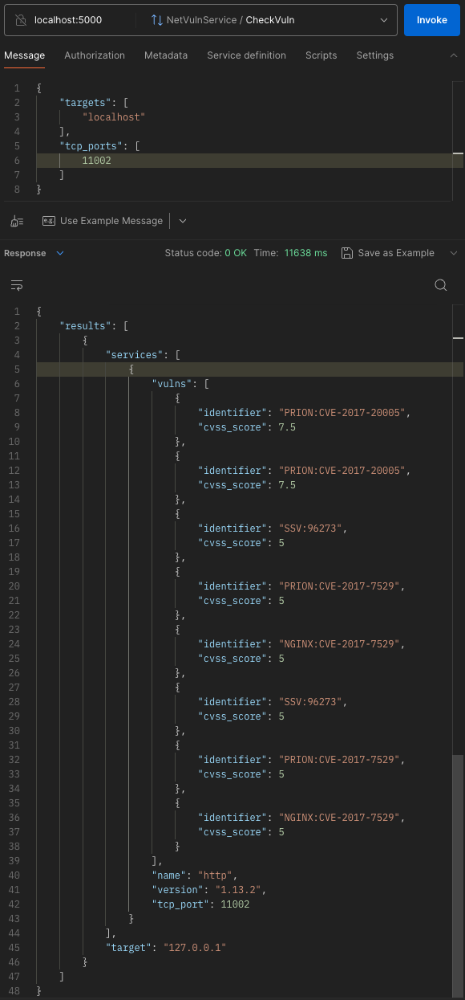

# Описание
Cервис для сканирования уязвимостей сервера с помощью [скрипта](https://github.com/vulnersCom/nmap-vulners) для nmap

## Стек технологий
- Golang 1.22
- gRPC
- Testify
- Docker

## Фичи
- Clean Architecture
- Docker образ
- CI
- e2e тесты

## Инструкция к Makefile

> [!NOTE]
> Для запуска сервиса требуется установленный nmap

Запуск и сборка
```sh
make run
```

Только сборка
```sh
make build
```

Запуск в Docker контейнере
```sh
make docker-run
```
> Помните, что изнутри контейнера нельзя постучаться в `localhost` из-за виртуальной сети Docker, поэтому для ручного тестирования приложения, запущенного через Docker с mock-серверами, необходимо, чтобы оба контейнера были запущены в одной [сети](https://docs.docker.com/network/).

Запуск линтера
```sh
make lint
```

Очистка артефактов
```sh
make clean
```

Генерация gRPC файлов
```sh
make generate-proto
```

### Запуск тестов

> [!NOTE]
> Для запуска тестов необходим Docker

Сначала необходимо поднять тестовые серверы с уязвимостями внутри Docker контейнера
```sh
make docker-mock-vuln-server
```

Затем можно запускать тесты
```sh
make test
```

## Описание конфига
Можно указывать значения как в `config.yml`, так и через переменные окружения (они имеют приоритет)
```yml
grpc:
  port: # int; env: GRPC_PORT

logger:
  level: # возможные значения: debug, error, warn, info; env: LOGGER_LEVEL

vulners:
  check_timeout: # таймаут сканирования хоста; env: VULNERS_CHECK_TIMEOUT
```

Значения по умолчанию:
```yml
grpc:
  port: 3000

logger:
  level: info

vulners:
  check_timeout: 1m
```

## Примеры использования
### CheckVuln


## Возникшие трудности
- много времени ушло на нахождение способа запуска mock-серверов с уязвимостями через Docker, сначала шел через написание докерфайла с `FROM ubuntu:latest`, чтобы можно было сразу выполнить там все необходимые установки этих серверов, но суть в том, что для их запуска нужен Docker, и, оказывается, его так просто не установить внутри контейнера. Поэтому было решено взять `docker:dind` - образ с заранее установленным докером и запускать в нем скрипт `startup.sh` через `docker exec`. Кстати, для запуска моковых серверов с уязвимостями используется [vulnhub](https://github.com/vulhub/vulhub).

## Возможные улучшения
- добавить кэширование
- реализовать параллельность проверки хостов через семафор в [CheckVuln](https://github.com/NikolaB131/nmap-vulners-service/blob/a4b8f404a3751e0109860cb51276ff6800dcfe37/internal/service/vulners.go#L32) (можно и без семафора, но тогда горутины будут неограничены в количестве и могут съесть много ресурсов)
- добавить линетр получше
